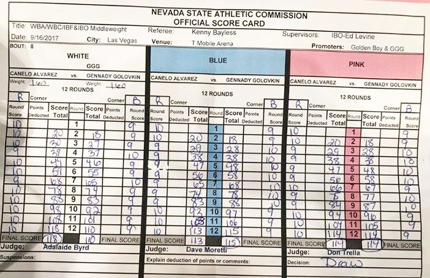
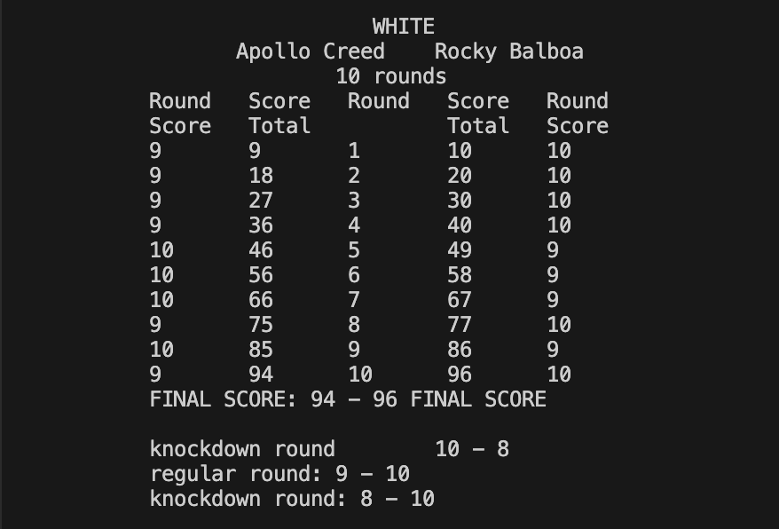
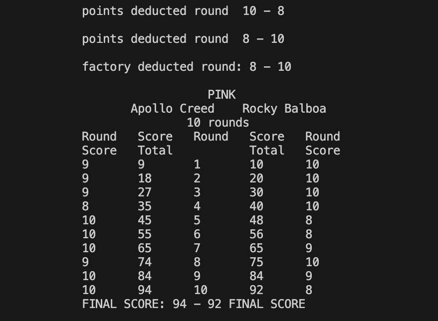
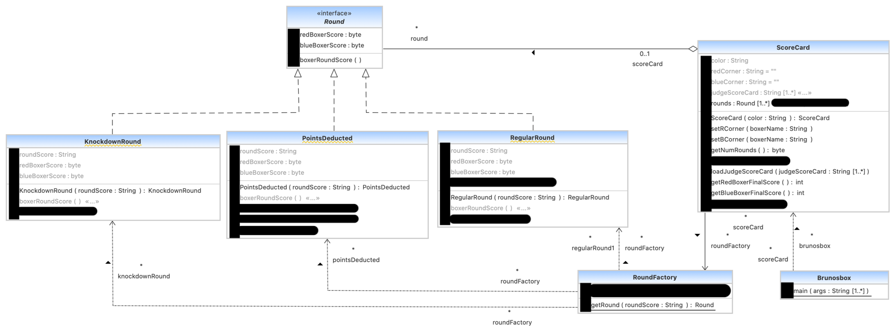

Frank Bruno's Boxing
====================  

## En el ring

### ¿Cómo se puntua un combate de boxeo?

En un combate de boxeo, hay tres jueces/zas sentados al lado del ring.

Cada uno de ellos/as rellena una tarjeta de puntos. En este caso: blanca, azul y rosa.

El actual sistema de puntuación del boxeo se conoce como "Sistema obligatorio de 10 puntos". 

Esta es una descripción general básica de cómo funciona:

- Los jueces califican cada asalto en una escala de 10 puntos. La mayoría de asaltos se califican `10-9`, con el boxeador/a que lo hizo mejor puntuando `10` y "ganando" el asalto, y el otro boxeador/a puntuando `9`.
- Si un boxeador es derribado o lastimado lo suficiente como para que el árbitro cuente de pie, ese boxeador pierde un punto. Si un púgil domina un asalto, controla y lanza mejores golpes en todo momento y derriba a su oponente, el resultado final del asalto es `10-8`.
- El /la árbitro puede indicar a los tres jueces/zas que resten un punto a un púgil en cualquier asalto. Lo harán si éste ha hecho algo para romper las reglas, como una falta intencionada (un golpe bajo, un cabezazo o, el favorito de Mike Tyson, morder la oreja de un oponente).

### Resultado de la pelea.

Si nadie ha ganado por _knockout_ después del número programado de asaltos (pueden ser 10 o 12 asaltos), las tarjetas de puntuación de los jueces determinarán el ganador/a.

Cada uno de los tres jueces/zas tendrá un ganador/a general o pueden puntuar la pelea empatada.

- Decisión unánime: los tres jueces tienen al mismo boxeador líder en sus tarjetas de puntuación.
- Decisión dividida: dos jueces tienen al Boxeador A primero, mientras que un juez tiene al Boxeador B líder. Eso significa que el Boxeador A gana, dos tarjetas de puntuación a una.
- Decisión de la mayoría: dos jueces tienen un peleador por delante, mientras que el tercer juez lo puntúa como empate. El boxeador ganador no obtuvo una decisión unánime, pero se llevó la mayoría de las puntuaciones.
- Empate: si un juez tiene al boxeador A por delante, un juez tiene al boxeador B por delante y el tercero lo ha puntuado como empate, el resultado general es un empate (también conocido como "empate dividido"). Por supuesto, si los tres jueces terminaron empatados, también es un empate (un 'empate unánime').
- Empate mayoritario: si dos de los tres jueces tienen una pelea igualada pero el tercer juez tenía al boxeador A por delante, una ventaja tan pequeña no es suficiente para que el boxeador A sea declarado ganador. En cambio, se declara un 'sorteo mayoritario'.

## Salida de la aplicación

La aplicación principal es `Brunosbox.java`.

## Diagrama de clases UML / Arquitectura de la app.

Sigue el diagrama de clase UML proporcionado para construir la aplicación.
Si añades algún componente, dibújalo sobre el diagrama.

